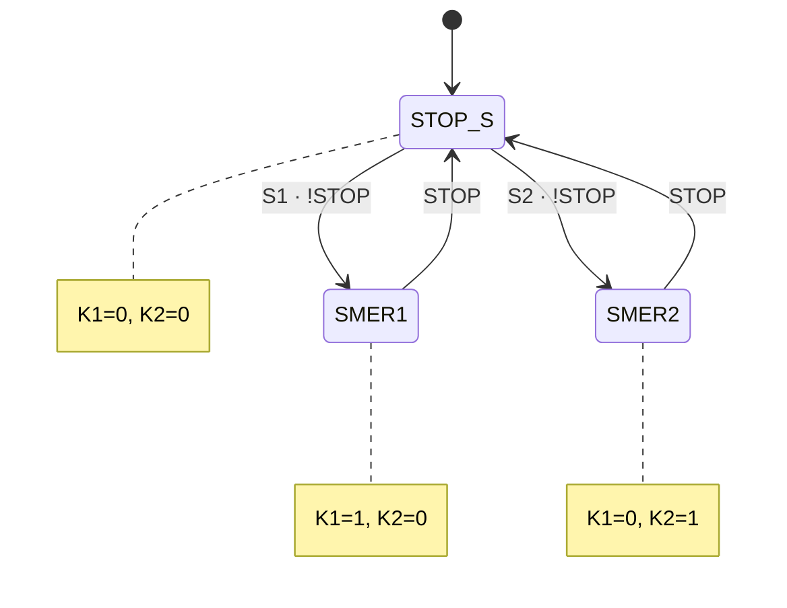
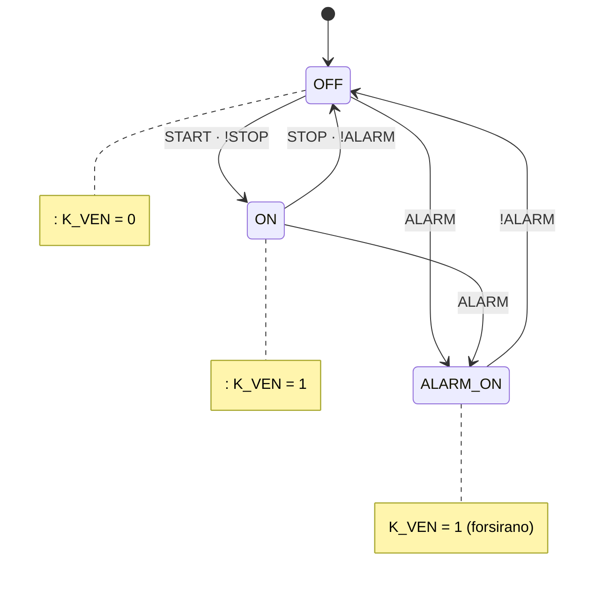

# Rešitve — Kolokvij: Programirljivi logični krmilniki

> **Interno gradivo — ne deliti s študenti pred kolokvijem**

---

## Naloga 1 — Normalne oblike logične funkcije

Izhodiščna enačba: $F(A, B, C) = A \cdot B + B \cdot C + A \cdot \overline{C}$

---

### a) Pravilnostna tabela *(5 točk)*

Izračun po členih za vsako kombinacijo vhodov:

| # | A | B | C | A·B | B·C | A·!C | F |
|:-:|:-:|:-:|:-:|:---:|:---:|:----:|:-:|
| 0 | 0 | 0 | 0 |  0  |  0  |  0   | **0** |
| 1 | 0 | 0 | 1 |  0  |  0  |  0   | **0** |
| 2 | 0 | 1 | 0 |  0  |  0  |  0   | **0** |
| 3 | 0 | 1 | 1 |  0  |  1  |  0   | **1** |
| 4 | 1 | 0 | 0 |  0  |  0  |  1   | **1** |
| 5 | 1 | 0 | 1 |  0  |  0  |  0   | **0** |
| 6 | 1 | 1 | 0 |  1  |  0  |  1   | **1** |
| 7 | 1 | 1 | 1 |  1  |  1  |  0   | **1** |

Mintermi (F = 1): **3, 4, 6, 7**  
Makstermi (F = 0): **0, 1, 2, 5**

**Ocenjevanje:** 0,5 točke za vsako pravilno vrstico (8 × 0,5 = 4 točke) + 1 točka za pravilni seznam mintermov/makstermov.

---

### b) PDNO — Popolna disjunktivna normalna oblika *(5 točk)*

Vsak mintrem zapišemo kot produkt vseh treh spremenljivk:

| mintrem | A | B | C | člen |
|:-------:|:-:|:-:|:-:|------|
| m₃ | 0 | 1 | 1 | $\overline{A}\cdot B\cdot C$ |
| m₄ | 1 | 0 | 0 | $A\cdot\overline{B}\cdot\overline{C}$ |
| m₆ | 1 | 1 | 0 | $A\cdot B\cdot\overline{C}$ |
| m₇ | 1 | 1 | 1 | $A\cdot B\cdot C$ |

$$\boxed{F_{PDNO} = \overline{A}BC + A\overline{B}\overline{C} + AB\overline{C} + ABC}$$

**Ocenjevanje:** 1 točka za vsak pravilni mintrem + 1 točka za pravilno vsoto.

---

### c) PKNO — Popolna konjunktivna normalna oblika *(5 točk)*

Vsak makstrem (F = 0) zapišemo kot vsoto spremenljivk (negiramo vrednosti 1, ohranimo vrednosti 0):

| makstrem | A | B | C | člen |
|:--------:|:-:|:-:|:-:|------|
| M₀ | 0 | 0 | 0 | $(A + B + C)$ |
| M₁ | 0 | 0 | 1 | $(A + B + \overline{C})$ |
| M₂ | 0 | 1 | 0 | $(A + \overline{B} + C)$ |
| M₅ | 1 | 0 | 1 | $(\overline{A} + B + \overline{C})$ |

$$\boxed{F_{PKNO} = (A+B+C)\cdot(A+B+\overline{C})\cdot(A+\overline{B}+C)\cdot(\overline{A}+B+\overline{C})}$$

**Ocenjevanje:** 1 točka za vsak pravilni makstrem (4 × 1 = 4 točke) + 1 točka za pravilni produkt.

---

### d) MDNO — Minimalna disjunktivna normalna oblika *(5 točk)*

Minimizirajmo **enice** (1-celice): m₃, m₄, m₆, m₇

**Veitch diagram:**

| AB \ C | 0 | 1 |
|:------:|:-:|:-:|
|   00   | 0 | 0 |
|   01   | 0 | **1** |
|   11   | **1** | **1** |
|   10   | **1** | 0 |

**Gruče:**

- 🔵 **Gruča 1** — celice m₃, m₇ (vrstici 01 in 11, C=1 → B=1, C=1): $B \cdot C$
- 🟠 **Gruča 2** — celice m₄, m₆ (vrstici 10 in 11, C=0 → A=1, !C=1): $A \cdot \overline{C}$

Pokritost: m₃ ← 🔵 | m₄ ← 🟠 | m₆ ← 🟠 | m₇ ← 🔵

$$\boxed{F_{MDNO} = B\cdot C + A\cdot\overline{C}}$$

> **Ključna opomba:** Izhodiščna enačba je imela tri člene ($AB + BC + A\overline{C}$), MDNO pa ima samo dva. Člen $A \cdot B$ je bil **odveč** (redundanten) — pokrit že z $BC$ (m₇) in $A\overline{C}$ (m₆).

**Ocenjevanje:** 1 točka Veitch diagram, 2 točki gruči, 1 točka enačba, 1 točka razlaga redundance.

---

### e) MKNO — Minimalna konjunktivna normalna oblika *(5 točk)*

Minimizirajmo **ničle** (0-celice): m₀, m₁, m₂, m₅

**Veitch diagram (ničle):**

| AB \ C | 0 | 1 |
|:------:|:-:|:-:|
|   00   | **0** | **0** |
|   01   | **0** | 1 |
|   11   | 1 | 1 |
|   10   | 1 | **0** |

**Gruče ničel:**

- 🔵 **Gruča 1** — celice m₂, m₀ (vrstici 00 in 01 NE — ampak m₀,m₂ sta v vrsticah 00, 01 pri C=0):
  - m₀(00,C=0) in m₂(01,C=0): A=0, C=0 → $\overline{A}\cdot\overline{C}$ → makstermski člen: $(A+C)$
- 🟠 **Gruča 2** — celice m₁, m₅ (C=1, B=0 → vrstici 00, 10):
  - m₁(A=0,B=0,C=1) in m₅(A=1,B=0,C=1): B=0, C=1 → $\overline{B}\cdot C$ → makstermski člen: $(B+\overline{C})$

Pokritost ničel: m₀ ← 🔵 | m₁ ← 🟠 | m₂ ← 🔵 | m₅ ← 🟠

$$\boxed{F_{MKNO} = (A+C)\cdot(B+\overline{C})}$$

**Verifikacija makstermov:**

| # (ABC) | A+C | B+!C | F |
|:-------:|:---:|:----:|:-:|
| 0 (000) | 0+0=**0** | — | 0 ✓ |
| 1 (001) | 0+1=1 | 0+0=**0** | 0 ✓ |
| 2 (010) | 0+0=**0** | — | 0 ✓ |
| 5 (101) | 1+1=1 | 0+0=**0** | 0 ✓ |
| 3 (011) | 0+1=1 | 1+0=1 | 1 ✓ |
| 6 (110) | 1+0=1 | 1+1=1 | 1 ✓ |

**Ocenjevanje:** 1 točka Veitch diagram, 2 točki gruči, 2 točki enačba.

---

## Naloga 2 — Sekvenčna funkcija: MDNO in lestvični diagram *(25 točk)*

Podani enačbi:

$$Q[k{+}1] = (A + Q[k]) \cdot \overline{B}$$

$$Y[k] = Q[k] \cdot C + \overline{Q[k]} \cdot A$$

### a) Pravilnostna tabela *(10 točk)*

| # | A | B | C | Q[k] | Q[k+1] | Y[k] |
|:-:|:-:|:-:|:-:|:----:|:------:|:----:|
| 0  | 0 | 0 | 0 | 0 | 0 | 0 |
| 1  | 0 | 0 | 0 | 1 | 1 | 0 |
| 2  | 0 | 0 | 1 | 0 | 0 | 0 |
| 3  | 0 | 0 | 1 | 1 | 1 | 1 |
| 4  | 0 | 1 | 0 | 0 | 0 | 0 |
| 5  | 0 | 1 | 0 | 1 | 0 | 0 |
| 6  | 0 | 1 | 1 | 0 | 0 | 0 |
| 7  | 0 | 1 | 1 | 1 | 0 | 1 |
| 8  | 1 | 0 | 0 | 0 | 1 | 1 |
| 9  | 1 | 0 | 0 | 1 | 1 | 0 |
| 10 | 1 | 0 | 1 | 0 | 1 | 1 |
| 11 | 1 | 0 | 1 | 1 | 1 | 1 |
| 12 | 1 | 1 | 0 | 0 | 0 | 1 |
| 13 | 1 | 1 | 0 | 1 | 0 | 0 |
| 14 | 1 | 1 | 1 | 0 | 0 | 1 |
| 15 | 1 | 1 | 1 | 1 | 0 | 1 |

**Kontrola:**
- za `B=1` je vedno `Q[k+1]=0`
- `Y[k]` je odvisen od trenutnega stanja `Q[k]` in vhodov `A, C`

### b) MDNO *(5 točk)*

Iz minimizacije:

$$\boxed{Q_{MDNO}[k{+}1] = A\overline{B} + Q[k]\overline{B}}$$

$$\boxed{Y_{MDNO}[k] = Q[k]C + \overline{Q[k]}A}$$

### c) Lestvični diagram na osnovi MDNO *(10 točk)*

Uporabimo rele stanja `KQ` (predstavlja `Q`) in rele izhoda `KY` (predstavlja `Y`).

```
 Rung 1: Q[k+1] = A!B + Q!B
                (KQ)
||---[/B]---+---[A]--------------------( )---||
      |
      +---[KQ]-------------------+

 Rung 2: Y[k] = QC + !QA
                (KY)
||---+---[KQ]---[C]--------------------( )---||
  |
  +---[/KQ]---[A]-------------------+
```

**Ocenjevanje:** 10 točk pravilnostna tabela, 5 točk MDNO, 10 točk pravilna realizacija v lestvičnem diagramu.

---

## Naloga 3 — Analiza sekvenčnega vezja *(25 točk)*

### a) Logični enačbi *(10 točk)*

Iz lestvičnega diagrama beremo:

**K1:** vzporedna S1 in K1 (samozadrževanje) → serijsko /STOP

$$\boxed{K1[k{+}1] = \bigl(S1 + K1[k]\bigr) \cdot \overline{STOP}}$$

**K2:** vzporedna S2 in K2 (samozadrževanje) → serijsko /STOP → serijsko /K1 (medsebojna blokada)

$$\boxed{K2[k{+}1] = \bigl(S2 + K2[k]\bigr) \cdot \overline{STOP} \cdot \overline{K1[k]}}$$

**Ocenjevanje:** 5 točk za vsako enačbo.

---

### b) Pravilnostna tabela *(10 točk)*

Stanje `K1[k]=0, K2[k]=0`:

$K1[k{+}1] = (S1 + 0) \cdot \overline{STOP} = S1 \cdot \overline{STOP}$

$K2[k{+}1] = (S2 + 0) \cdot \overline{STOP} \cdot \overline{0} = S2 \cdot \overline{STOP}$

| S1 | S2 | STOP | K1[k] | K2[k] | K1[k+1] | K2[k+1] |
|:--:|:--:|:----:|:-----:|:-----:|:-------:|:-------:|
|  0 |  0 |  0   |   0   |   0   |    0    |    0    |
|  0 |  0 |  1   |   0   |   0   |    0    |    0    |
|  0 |  1 |  0   |   0   |   0   |    0    |    1    |
|  0 |  1 |  1   |   0   |   0   |    0    |    0    |
|  1 |  0 |  0   |   0   |   0   |    1    |    0    |
|  1 |  0 |  1   |   0   |   0   |    0    |    0    |
|  1 |  1 |  0   |   0   |   0   |  **1**  |  **⚠**  |
|  1 |  1 |  1   |   0   |   0   |    0    |    0    |

> **⚠ Razlaga:** Ko `S1=1, S2=1, STOP=0` in sta oba K1[k]=0, K2[k]=0, blokada `!K1[k]` ne prepreči K2, ker K1 še ni vklopljen v **trenutnem** koraku. Oba releja se vklopita hkrati → nevarno stanje (K1=K2=1). Rešitev: hardverska medsebojna blokada ali blokada na osnovi K1[k+1].

**Ocenjevanje:** 1 točka za vsako pravilno vrstico (8 vrstic) + 2 točki razlaga ⚠.

---

### c) Diagram stanj *(5 točk)*



**Stanja:**
- **STOP** — motor ustavljen (K1=0, K2=0)
- **SMER1** — motor teče smer 1 (K1=1, K2=0)
- **SMER2** — motor teče smer 2 (K1=0, K2=1)

**Ocenjevanje:** 2 točki stanja, 3 točke prehodi.

---

## Naloga 4 — Implementacija sekvenčnega vezja: prezračevalni sistem *(25 točk)*

### a) Diagram stanj *(5 točk)*



**Opomba:** Ko ALARM preneha, sistem preide v OFF (ne ON) — ALARM ni samozadrževalen.

**Ocenjevanje:** 2 točki stanja, 3 točki prehodi (posebej 1 točka za prehod ALARM→OFF, ne ALARM→ON).

---

### b) Pravilnostna tabela *(10 točk)*

Logična enačba:

$$\boxed{K\_VEN[k{+}1] = ALARM + \bigl(START + K\_VEN[k]\bigr) \cdot \overline{STOP}}$$

**Razlaga:** ALARM neposredno sili izhod na 1 (bypass tipke STOP). Ko ALARM = 0, deluje standardno samozadrževanje z možnostjo zaustavitve.

| START | STOP | ALARM | K_VEN[k] | K_VEN[k+1] | Opomba |
|:-----:|:----:|:-----:|:--------:|:----------:|--------|
|   0   |  0   |   0   |    0     |     0      | mirovanje |
|   0   |  0   |   1   |    0     |     1      | ALARM vklopi |
|   0   |  1   |   0   |    0     |     0      | STOP brez efekta |
|   0   |  1   |   1   |    0     |     1      | ALARM ignorira STOP |
|   1   |  0   |   0   |    0     |     1      | START |
|   1   |  1   |   0   |    0     |     0      | STOP > START |
|   0   |  0   |   0   |    1     |     1      | samozadrževanje |
|   0   |  0   |   1   |    1     |     1      | ALARM + tek |
|   0   |  1   |   0   |    1     |     0      | zaustavitev |
|   0   |  1   |   1   |    1     |     1      | ALARM blokira STOP |

**Ocenjevanje:** 1 točka za vsako pravilno vrstico.

---

### c) Lestvični diagram *(10 točk)*

```
 Samozadrževanje z zaustavitvijo:
                                        (K_VEN)
||---+---[START]---+---[/STOP]----------( )---||
     |             |
     +--[K_VEN]---+

 ALARM bypass (vzporedna veja, premosti /STOP):
                                        (K_VEN)
||---[ALARM]-----------------------------( )---||
```

**Kombinirani pogled (ena tuljava, dve vzporedni poti):**

```
                                              (K_VEN)
||---+---+---[START]---+---[/STOP]---+-------( )---||
     |   |             |             |
     |   +--[K_VEN]---+             |
     |                              |
     +---[ALARM]-------------------+
```

**Opis:**
- Zgornja veja: `(START || K_VEN) · /STOP` — standardno samozadrževanje
- Spodnja veja: `ALARM` — neposredna prisilna aktivacija (STOP nima vpliva)

**Ocenjevanje:** 4 točke samozadrževanje (START + selfhold + /STOP), 4 točke ALARM bypass, 2 točki pravilna tuljava K_VEN.

---

## Točkovanje — pregled

| Naloga | Pod-naloga | Točke | Kriterij |
|--------|-----------|------:|---------|
| 1 | a) Pravilnostna tabela | 5 | 0,5 t/vrstica + 1 t mintermi/makstermi |
| 1 | b) PDNO | 5 | 1 t/mintrem + 1 t vsota |
| 1 | c) PKNO | 5 | 1 t/makstrem + 1 t produkt |
| 1 | d) MDNO | 5 | 1 Veitch + 2 gruči + 1 enačba + 1 redundanca |
| 1 | e) MKNO | 5 | 1 Veitch + 2 gruči + 2 enačba |
| 2 | Sekvenčna funkcija (Q+, Y) | 25 | 10 pravilnostna tabela + 5 MDNO + 10 ladder |
| 3 | a) Enačbi | 10 | 5 t/enačbo |
| 3 | b) Tabela | 10 | 1 t/vrstica + 2 razlaga |
| 3 | c) Diagram stanj | 5 | 2 stanja + 3 prehodi |
| 4 | a) Diagram stanj | 5 | 2 stanja + 3 prehodi |
| 4 | b) Tabela + enačba | 10 | 1 t/vrstica |
| 4 | c) Ladder diagram | 10 | 4+4+2 |
| **Skupaj** | | **100** | |
