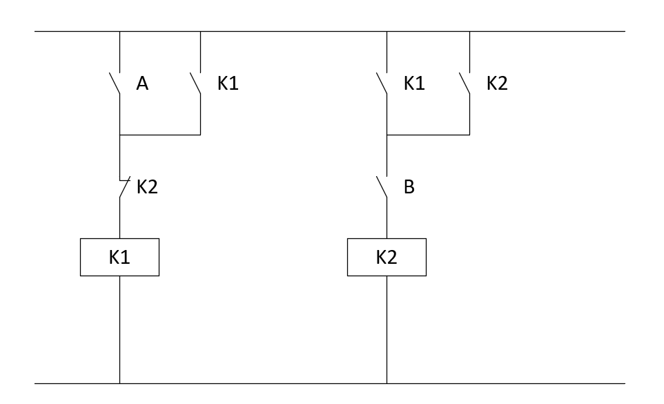
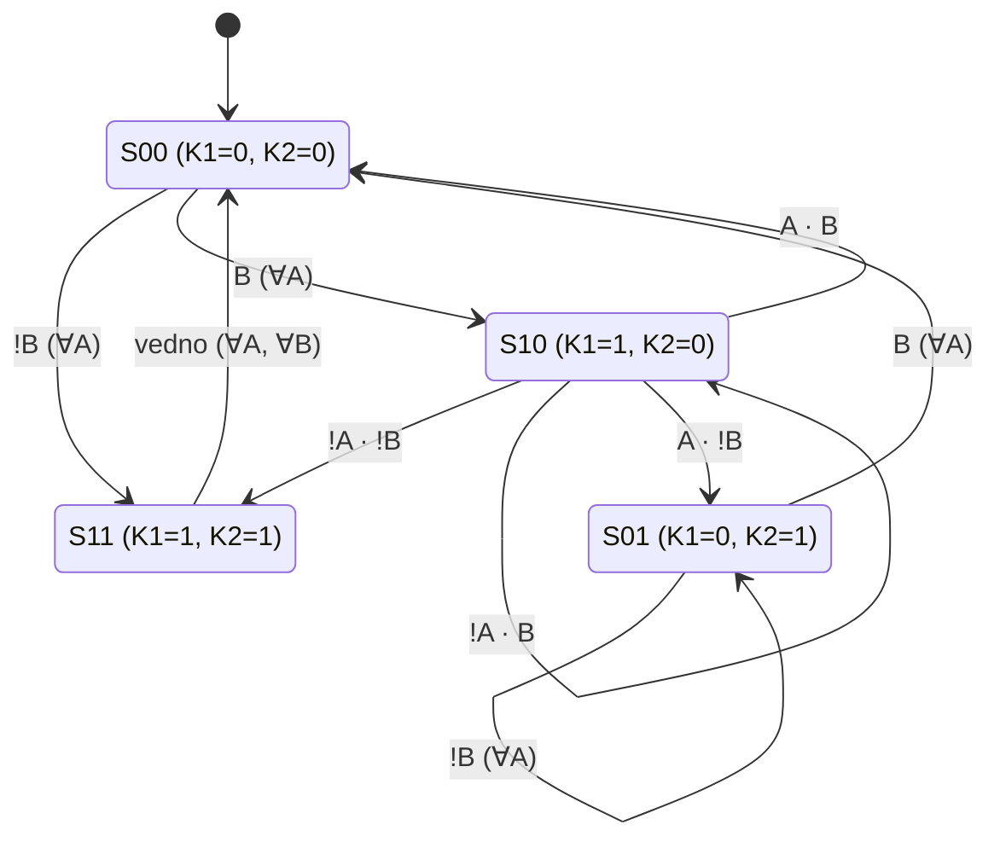

---

## Naloga 1 — Normalne oblike logične funkcije *(25 točk)*

Izhodiščna enačba:

$$F(A, B, C, D) = (A \oplus B) \cdot (C \equiv D) + (A \uparrow D)$$

Razlaga operatorjev:
- $A \oplus B$ — XOR: $A\overline{B} + \overline{A}B$
- $C \equiv D$ — XNOR: $\overline{C}\,\overline{D} + CD$
- $A \uparrow D$ — NAND: $\overline{A \cdot D} = \overline{A} + \overline{D}$

---

### 1.1 Pravilnostna tabela *(10 točk)*

| # | A | B | C | D | A⊕B | C≡D | (A⊕B)·(C≡D) | A↑D | **F** |
|:-:|:-:|:-:|:-:|:-:|:---:|:---:|:-----------:|:---:|:-----:|
|  0 | 0 | 0 | 0 | 0 |  0  |  1  |      0      |  1  | **1** |
|  1 | 0 | 0 | 0 | 1 |  0  |  0  |      0      |  1  | **1** |
|  2 | 0 | 0 | 1 | 0 |  0  |  0  |      0      |  1  | **1** |
|  3 | 0 | 0 | 1 | 1 |  0  |  1  |      0      |  1  | **1** |
|  4 | 0 | 1 | 0 | 0 |  1  |  1  |      1      |  1  | **1** |
|  5 | 0 | 1 | 0 | 1 |  1  |  0  |      0      |  1  | **1** |
|  6 | 0 | 1 | 1 | 0 |  1  |  0  |      0      |  1  | **1** |
|  7 | 0 | 1 | 1 | 1 |  1  |  1  |      1      |  1  | **1** |
|  8 | 1 | 0 | 0 | 0 |  1  |  1  |      1      |  1  | **1** |
|  9 | 1 | 0 | 0 | 1 |  1  |  0  |      0      |  0  | **0** |
| 10 | 1 | 0 | 1 | 0 |  1  |  0  |      0      |  1  | **1** |
| 11 | 1 | 0 | 1 | 1 |  1  |  1  |      1      |  0  | **1** |
| 12 | 1 | 1 | 0 | 0 |  0  |  1  |      0      |  1  | **1** |
| 13 | 1 | 1 | 0 | 1 |  0  |  0  |      0      |  0  | **0** |
| 14 | 1 | 1 | 1 | 0 |  0  |  0  |      0      |  1  | **1** |
| 15 | 1 | 1 | 1 | 1 |  0  |  1  |      0      |  0  | **0** |

### 1.2 PDNO in PKNO *(5 točk)*

$F_{PDNO} = \sum(0, 1, 2, 3, 4, 5, 6, 7, 8, 10, 11, 12, 14)$
$F_{PKNO} = \prod(0, 2, 6)$


#### Veitchov diagram

|     |     |  A  |  A  |     |     |
|-----|-----|-----|-----|-----|-----|
|  B  |  1  |  1  |  1  |  1  |  1  |
|  B  |  1  |  1  |  1  |  1  |  1  |
|     |  1  |  0  |  0  |  1  |  1  |
|     |  1  |  0  |  1  |  1  |  1  |
|     |     |  C  |  C  |     |     |

MDNO: $F_{MDNO} = \overline{A} + \overline{D} + \overline{B}C$


---

## Naloga 2 — Sekvenčna funkcija: MDNO in lestvični diagram *(25 točk)*

Podani enačbi:

$$Q[k{+}1] = (A + Q[k]) \cdot \overline{B}$$

$$Y[k] = Q[k] \cdot C + \overline{Q[k]} \cdot A$$

### 1. Pravilnostna tabela *(10 točk)*

| # | A | B | C | Q[k] | Q[k+1] | Y[k] |
|:-:|:-:|:-:|:-:|:----:|:------:|:----:|
|  0 | 0 | 0 | 0 | 0 | 0 | 0 |
|  1 | 0 | 0 | 0 | 1 | 1 | 0 |
|  2 | 0 | 0 | 1 | 0 | 0 | 0 |
|  3 | 0 | 0 | 1 | 1 | 1 | 1 |
|  4 | 0 | 1 | 0 | 0 | 0 | 0 |
|  5 | 0 | 1 | 0 | 1 | 0 | 0 |
|  6 | 0 | 1 | 1 | 0 | 0 | 0 |
|  7 | 0 | 1 | 1 | 1 | 0 | 1 |
|  8 | 1 | 0 | 0 | 0 | 1 | 1 |
|  9 | 1 | 0 | 0 | 1 | 1 | 0 |
| 10 | 1 | 0 | 1 | 0 | 1 | 1 |
| 11 | 1 | 0 | 1 | 1 | 1 | 1 |
| 12 | 1 | 1 | 0 | 0 | 0 | 1 |
| 13 | 1 | 1 | 0 | 1 | 0 | 0 |
| 14 | 1 | 1 | 1 | 0 | 0 | 1 |
| 15 | 1 | 1 | 1 | 1 | 0 | 1 |

**Kontrola:** za `B=1` je vedno `Q[k+1]=0`; `Y[k]` odvisen od `Q[k]`, `A` in `C`.

**Ocenjevanje:** 0,5 točke za vsako pravilno vrstico (16 × 0,5 = 8 točk) + 2 točki razlaga.

### 2. MDNO *(5 točk)*

Iz minimizacije (Q[k] označimo z Q za kratkost):

$$\boxed{Q_{MDNO}[k{+}1] = A\overline{B} + Q\overline{B}}$$

$$\boxed{Y_{MDNO}[k] = QC + \overline{Q}\cdot A}$$

Opomba: enačbi za $Y$ sta že minimalni — pokrivata ortogonalne primere brez redundance.

### 3. Lestvični diagram na osnovi MDNO *(10 točk)*

```
 Rung 1: Q[k+1] = A·/B + Q·/B = (A + Q)·/B
                                              (Q)
||----+----[ A ]----+----[/B]---------------( )----||
      |             |
      +----[ Q ]----+

 Rung 2: Y[k] = Q·C + /Q·A
                                              (Y)
||----+----[ Q ]----[ C ]------------------( )----||
      |
      +----[/Q ]----[ A ]------------------+
```

**Ocenjevanje:** 4 točke Rung 1, 4 točke Rung 2, 2 točki pravilni tuljavi.

---

## Naloga 3 — Analiza sekvenčnega vezja *(25 točk)*

Dan je lestvični diagram (glejte sliko v nalogi):



### 1. Logični enačbi *(5 točk)*

Iz lestvičnega diagrama beremo (vsi kontakti so **normalno zaprti — NC**):

**Levi Rung (K1):**
- Vzporedno: /A in /K1 (NC stiki)
- Serijsko: /K2 (NC stik)
- Izhod: tuljava K1

$$\boxed{K1[k{+}1] = \bigl(\overline{A} + \overline{K1[k]}\bigr) \cdot \overline{K2[k]}}$$

**Desni Rung (K2):**
- Vzporedno: /K1 in /K2 (NC stiki)
- Serijsko: /B (NC stik)
- Izhod: tuljava K2

$$\boxed{K2[k{+}1] = \bigl(\overline{K1[k]} + \overline{K2[k]}\bigr) \cdot \overline{B}}$$

**Ocenjevanje:** 2,5 točke za vsako pravilno enačbo.

---

### 2. Pravilnostna tabela *(10 točk)*

| # | A | B | K1[k] | K2[k] | K1[k+1] | K2[k+1] |
|:-:|:-:|:-:|:-----:|:-----:|:-------:|:-------:|
|  0 | 0 | 0 |   0   |   0   |    1    |    1    |
|  1 | 0 | 0 |   0   |   1   |    0    |    1    |
|  2 | 0 | 0 |   1   |   0   |    1    |    1    |
|  3 | 0 | 0 |   1   |   1   |    0    |    0    |
|  4 | 0 | 1 |   0   |   0   |    1    |    0    |
|  5 | 0 | 1 |   0   |   1   |    0    |    0    |
|  6 | 0 | 1 |   1   |   0   |    1    |    0    |
|  7 | 0 | 1 |   1   |   1   |    0    |    0    |
|  8 | 1 | 0 |   0   |   0   |    1    |    1    |
|  9 | 1 | 0 |   0   |   1   |    0    |    1    |
| 10 | 1 | 0 |   1   |   0   |    0    |    1    |
| 11 | 1 | 0 |   1   |   1   |    0    |    0    |
| 12 | 1 | 1 |   0   |   0   |    1    |    0    |
| 13 | 1 | 1 |   0   |   1   |    0    |    0    |
| 14 | 1 | 1 |   1   |   0   |    0    |    0    |
| 15 | 1 | 1 |   1   |   1   |    0    |    0    |

**Primer izračuna (#10):** A=1, B=0, K1=1, K2=0:
$K1' = (\overline{1}+\overline{1})\cdot\overline{0} = (0+0)\cdot 1 = 0$;
$K2' = (\overline{1}+\overline{0})\cdot\overline{0} = (0+1)\cdot 1 = 1$

**Ocenjevanje:** 0,5 točke za vsako pravilno vrstico (16 × 0,5 = 8 točk) + 2 točki razlaga.

---

### 3. Diagram prehajanja stanj *(10 točk)*

Stanja so določena z vrednostima (K1, K2):

| Stanje | K1 | K2 | Opis |
|--------|:--:|:--:|------|
| **S00** | 0 | 0 | Obe tuljavi izklopljeni |
| **S01** | 0 | 1 | Aktivna le K2 |
| **S10** | 1 | 0 | Aktivna le K1 |
| **S11** | 1 | 1 | Obe vklopljeni (prehodno!) |

**Prehodi:**


```mermaid
stateDiagram-v2
    S00 : S00 (K1=0, K2=0)
    S01 : S01 (K1=0, K2=1)
    S10 : S10 (K1=1, K2=0)
    S11 : S11 (K1=1, K2=1)

    [*] --> S00

    S00 --> S11 : !B  (∀A)
    S00 --> S10 : B   (∀A)

    S01 --> S01 : !B  (∀A)
    S01 --> S00 : B   (∀A)

    S10 --> S11 : !A · !B
    S10 --> S10 : !A · B
    S10 --> S01 : A · !B
    S10 --> S00 : A · B

    S11 --> S00 : vedno (∀A, ∀B)
```

**Ključne opombe:**
- **S11 je vedno prehodno** — v naslednjem ciklu obe tuljavi ugasneta (ker K1=K2=1 → /K1=0, /K2=0 blokirata oba Runga)
- **S01 je stabilno** ko B=0 (K2 se drži prek vzporednega /K2 in /K1)
- **S10 je stabilno** ko A=0 in B=1

**Ocenjevanje:** 2 točki za pravilna stanja, 8 točk za pravilne prehode.

---

## Naloga 4 — Realizacija sekvenčnega vezja iz enačb *(25 točk)*

Podani enačbi:

$$K1[k{+}1] = (A + K1[k]) \cdot \overline{K2[k]}$$
$$K2[k{+}1] = (B + K2[k]) \cdot \overline{A} \cdot K1[k]$$

### 1. Pravilnostna tabela *(10 točk)*

| # | A | B | K1[k] | K2[k] | K1[k+1] | K2[k+1] |
|:-:|:-:|:-:|:-----:|:-----:|:-------:|:-------:|
|  0 | 0 | 0 |   0   |   0   |    0    |    0    |
|  1 | 0 | 0 |   0   |   1   |    0    |    0    |
|  2 | 0 | 0 |   1   |   0   |    1    |    0    |
|  3 | 0 | 0 |   1   |   1   |    0    |    1    |
|  4 | 0 | 1 |   0   |   0   |    0    |    0    |
|  5 | 0 | 1 |   0   |   1   |    0    |    0    |
|  6 | 0 | 1 |   1   |   0   |    1    |    1    |
|  7 | 0 | 1 |   1   |   1   |    0    |    1    |
|  8 | 1 | 0 |   0   |   0   |    1    |    0    |
|  9 | 1 | 0 |   0   |   1   |    0    |    0    |
| 10 | 1 | 0 |   1   |   0   |    1    |    0    |
| 11 | 1 | 0 |   1   |   1   |    0    |    0    |
| 12 | 1 | 1 |   0   |   0   |    1    |    0    |
| 13 | 1 | 1 |   0   |   1   |    0    |    0    |
| 14 | 1 | 1 |   1   |   0   |    1    |    0    |
| 15 | 1 | 1 |   1   |   1   |    0    |    0    |

**Opomba:** Ko A=1 je $\overline{A}=0$, zato K2[k+1]=0 ne glede na ostale pogoje (vrstice 8–15).

**Primer izračuna (#6):** A=0, B=1, K1=1, K2=0:
$K1' = (0+1)\cdot\overline{0} = 1$; $K2' = (1+0)\cdot\overline{0}\cdot 1 = 1$

**Ocenjevanje:** 0,5 točke za vsako pravilno vrstico (16 × 0,5 = 8 točk) + 2 točki opomba o A=1.

---

### 2. Lestvični diagram na osnovi enačb *(15 točk)*

Neposredna realizacija iz podanih enačb:

```
 Rung 1: K1[k+1] = (A + K1)·/K2
                                              (K1)
||----+----[ A  ]----+----[/K2]------------( )----||
      |              |
      +----[ K1 ]----+


 Rung 2: K2[k+1] = (B + K2)·/A·K1
                                              (K2)
||----+----[ B  ]----+----[/A ]----[ K1 ]--( )----||
      |              |
      +----[ K2 ]----+
```

**Razlaga vezja:**
- **K1**: samozadrž. krog (A ali K1) z blokiranjem prek /K2
- **K2**: aktivira se prek B (ali samo-drži), a le ko A=0 in K1=1 — K2 ne more biti aktiven brez K1
- **Medsebojna blokada**: K2 je blokiran z /K2 na Rungu 1, K1 je pogoj za K2 na Rungu 2

**Ocenjevanje:** 5 točk Rung 1 (samozadrž. + /K2), 7 točk Rung 2 (samozadrž. + /A + K1), 3 točke razlaga blokade.

---

## Točkovanje — pregled

| Naloga | Pod-naloga | Točke | Kriterij |
|--------|-----------|------:|---------|
| 1 | Pravilnostna tabela | 10 | 0,5 t/vrstica + 1 t mintermi + 1 t makstermi |
| 1 | PDNO + PKNO | 5 | 1 t PDNO + 1 t/makstrem + 2 t produkt |
| 1 | MDNO + MKNO | 10 | 2 t K-mapa + 3 t gruče + 1 t MDNO + 2 t gruče + 2 t MKNO |
| 2 | Pravilnostna tabela | 10 | 0,5 t/vrstica + 2 t razlaga |
| 2 | MDNO | 5 | 2,5 t/enačba |
| 2 | Lestvični diagram | 10 | 4+4+2 |
| 3 | Logični enačbi | 5 | 2,5 t/enačba |
| 3 | Pravilnostna tabela | 10 | 0,5 t/vrstica + 2 t razlaga |
| 3 | Diagram stanj | 10 | 2 t stanja + 8 t prehodi |
| 4 | Pravilnostna tabela | 10 | 0,5 t/vrstica + 2 t opomba |
| 4 | Lestvični diagram | 15 | 5+7+3 |
| **Skupaj** | | **100** | |

