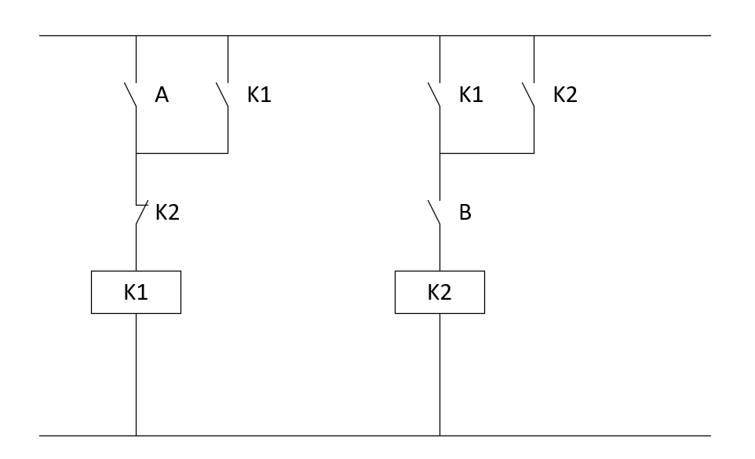

# Kolokvij — Programirljivi logični krmilniki

---

## Naloga 1 — Normalne oblike logične funkcije (25 točk)

Dana je logična funkcija štirih spremenljivk:

$$F(A, B, C, D) = (A \oplus B) \cdot (C \equiv D) + (A \uparrow D)$$

1. Zapišite pravilnostno tabelo za $F(A,B,C,D)$ *(10 točk)*

2. Zapišite $F_{PDNO}$ in $F_{PKNO}$ *(5 točk)*

3. Zapišite $F_{MDNO}$ in $F_{MKNO}$ *(10 točk)*

## Naloga 2 — Sekvenčna funkcija: MDNO in lestvični diagram (25 točk)

Podani sta enačbi sekvenčnega vezja:

$$Q[k{+}1] = (A + Q[k]) \cdot \overline{B}$$

$$Y[k] = Q[k] \cdot C + \overline{Q[k]} \cdot A$$

1. Sestavite pravilnostno tabelo *(10 točk)*

2. Zapišite MDNO $Q[k+1]$ in $Y[k]$ *(5 točk)*

3. Realizirajte vezje z lestvičnim diagramom na podlagi MDNO *(10 točk)*

---

## Naloga 3 — Analiza sekvenčnega vezja (25 točk)

Dan je lestvični diagram sekvenčnega vezja:

1. Logični enačbi *(5 točk)*

2. Pravilnostna tabela *(10 točk)*

3. Diagram prehajanja  stanj *(10 točk)*

---

## Naloga 4 — Realizacija sekvenčnega vezja iz enačb (25 točk)

Podani sta enačbi sekvenčnega vezja z dvema vhodoma ($A$, $B$) in dvema izhodoma ($K1$, $K2$):

$$K1[k{+}1] = (A + K1[k]) \cdot \overline{K2[k]}$$
$$K2[k{+}1] = (B + K2[k]) \cdot \overline{A} \cdot K1[k]$$

1. Sestavi pravilnostno tabelo *(10 točk)*

2. Realizirajte vezje z lestvičnim diagramom na podlagi podanih enačb *(15 točk)*

