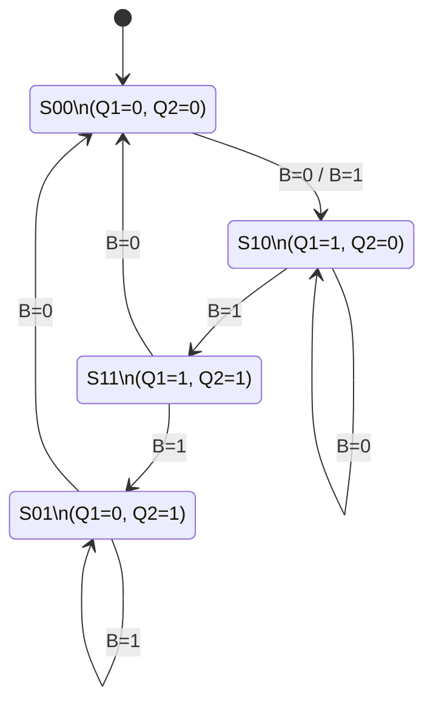
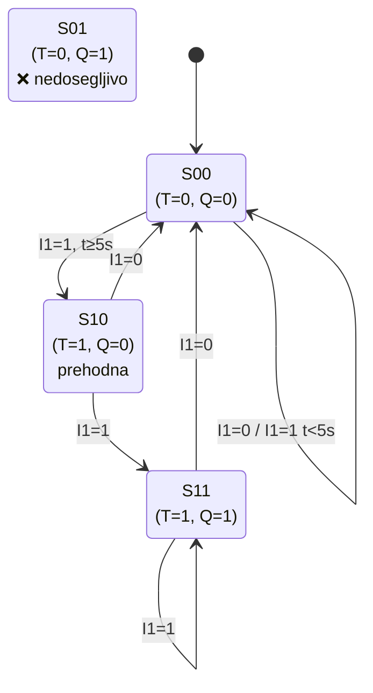
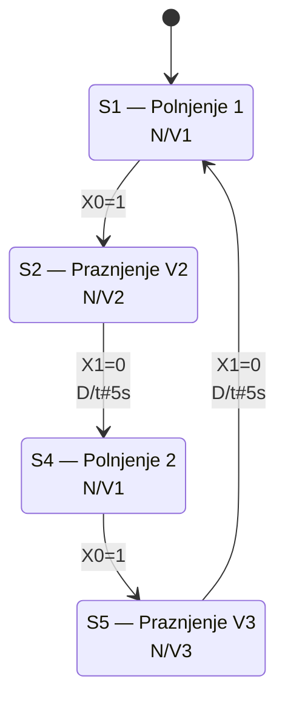

# Kolokvij 2 — Rešitve

---

## Naloga 1 — Analiza logičnega vezja (25 točk)

### Opis vezja

Vezje vsebuje dve robno-proženi RS-pomnilni celici (FF1 in FF2) in vrata XOR (=1):

- **FF1 (leva):** S = Vss = 1 (vedno visoko), R = Q2[k] (izhod FF2 kot ponastavitev)
- **FF2 (desna):** S = Q1[k] ⊕ Q2[k] (izhod vrat XOR), R = /B[k] (invertirani vhod B)
- B[k] je zunanji vhod (logična spremenljivka)

---

### 1.1 Logični enačbi *(5 točk)*

Za **R-dominantno RS-pomnilno celico** velja: $Q[k+1] = (S + Q[k]) \cdot \overline{R}$

**FF1:**

$$\boxed{Q1[k+1] = \overline{Q2[k]}}$$

*Izpeljava:* $Q1[k+1] = (1 + Q1[k]) \cdot \overline{Q2[k]} = \overline{Q2[k]}$

**FF2:**

$$\boxed{Q2[k+1] = \bigl(Q1[k] + Q2[k]\bigr) \cdot B[k]}$$

*Izpeljava:*
$Q2[k+1] = (Q1[k] \oplus Q2[k] + Q2[k]) \cdot \overline{(\overline{B[k]})}$
$= (Q1[k] \oplus Q2[k] + Q2[k]) \cdot B[k]$

Poenostavitev: $Q1 \oplus Q2 + Q2 = (\overline{Q1}\,Q2 + Q1\overline{Q2}) + Q2 = Q2 + Q1\overline{Q2} = Q1 + Q2$

---

### 1.2 Pravilnostna tabela *(10 točk)*

| # | B[k] | Q1[k] | Q2[k] | Q1[k+1] | Q2[k+1] |
|:-:|:----:|:-----:|:-----:|:-------:|:-------:|
| 0 |  0   |   0   |   0   |    1    |    0    |
| 1 |  0   |   0   |   1   |    0    |    0    |
| 2 |  0   |   1   |   0   |    1    |    0    |
| 3 |  0   |   1   |   1   |    0    |    0    |
| 4 |  1   |   0   |   0   |    1    |    0    |
| 5 |  1   |   0   |   1   |    0    |    1    |
| 6 |  1   |   1   |   0   |    1    |    1    |
| 7 |  1   |   1   |   1   |    0    |    1    |

**Kontrolna preveritev:**
- Vrstice 0–3 (B=0): Q2[k+1]=0 vedno (ker R2=/B=1 → ponastavitev FF2)
- Q1[k+1] je vedno komplement Q2[k]

**Ocenjevanje:** 1 točka za vsako pravilno vrstico (8 × 1 = 8 točk) + 2 točki za razlago.

---

### 1.3 Diagram prehajanja stanj *(10 točk)*

Stanja so določena z vrednostnima para (Q1, Q2):

| Stanje  | Q1 | Q2 | Opis                    |
|---------|:--:|:--:|-------------------------|
| **S00** |  0 |  0 | Obe pomnilni celici izklopljeni |
| **S01** |  0 |  1 | Aktivna le FF2          |
| **S10** |  1 |  0 | Aktivna le FF1          |
| **S11** |  1 |  1 | Obe vklopljeni          |

**Prehodi (iz pravilnostne tabele):**

| Iz stanja | B=0   | B=1   |
|-----------|-------|-------|
| S00 (0,0) | → S10 | → S10 |
| S01 (0,1) | → S00 | → S01 |
| S10 (1,0) | → S10 | → S11 |
| S11 (1,1) | → S00 | → S01 |

```
        B=0 ali B=1
    ┌──────────────────┐
    ▼                  │
  ┌────┐    B=0    ┌────┐
  │ S00│ ◄──────── │ S01│ ◄──┐
  └──┬─┘           └────┘    │B=1
     │B=0/B=1           ▲    │
     │                  │B=1 │
     ▼                  │    │
  ┌────┐    B=1    ┌────┐    │
  │ S10│ ──────► │ S11│ ────┘
  │    │ ◄──────  └────┘
  └────┘  B=0(samo)  │ B=0
     ▲               │
     └───────────────┘ (B=0, S10→S10)
```



**Ocenjevanje:** 2 točki za vsako pravilno definirano stanje in prehode (4 stanja × 2 = 8 točk + 2 točki za razlago).

---

## Naloga 2 — Analiza sekvenčnega vezja (25 točk)

### Opis vezja (FBD)

Vezje v FBD notaciji vsebuje:

| Blok      | Tip   | Opis                              |
|-----------|-------|-----------------------------------|
| I1        | Vhod  | Digitalni vhod (sproži cikel)     |
| T_ON      | TON   | Zakasnilni časovnik, PT = t#5s    |
| B002      | AND   | Logična vrata AND z izhodnim R    |
| Q         | Izhod | Digitalni izhod (s povratno zanko)|

**Matematični opis:**

Ker TON ni čisto boolean element, uvedemo pomožno boolean spremenljivko **T[k]** (= T_ON.Q):

$$T[k+1] = I1[k] \cdot \bigl((t > 5s) + T[k]\bigr)$$

$$Q[k+1] = I1[k] \cdot \bigl(T[k] + Q[k]\bigr)$$

*Razlaga T:* T gre na 1, ko je I1=1 in je preteklo več kot 5s. Ko je T=1 in I1=1, se drži (self-hold). Ko I1=0, se T ponastavi na 0.

*Razlaga Q:* T in Q sta priključena na isti vhod AND vrat (vzporedno → logični ALI). Ko se Q enkrat aktivira (po 5s), se sam drži aktivnega prek povratne zanke, vse dokler je I1=1.

---

### Diagram prehajanja stanj *(25 točk)*

**Stanja** (spremenljivki stanja: T, Q):

| Stanje  | T | Q | Opis                          | Dosegljivo |
|---------|:-:|:-:|-------------------------------|:----------:|
| **S00** | 0 | 0 | Mirovanje / merjenje časa     | ✓          |
| **S01** | 0 | 1 | —                             | ✗          |
| **S10** | 1 | 0 | Prehodna (1 cikel)            | ✓          |
| **S11** | 1 | 1 | Aktiven izhod (self-hold)     | ✓          |

**Pogoji prehodov:**

| Prehod      | Pogoj              | Opis                              |
|-------------|--------------------|-----------------------------------|
| S00 → S00   | I1=1, t < 5s       | Timer teče, Q ostane 0            |
| S00 → S00   | I1=0               | Mirovanje                         |
| S00 → S10   | I1=1, t ≥ 5s       | Timer poteče, T→1, Q še 0         |
| S10 → S11   | I1=1               | Naslednji cikel: Q→1              |
| S10 → S00   | I1=0               | I1 pade, reset                    |
| S11 → S11   | I1=1               | Q se drži (self-hold)             |
| S11 → S00   | I1=0               | I1 pade, Q in T se deaktivirata   |



**Akcije po stanjih:**

- **S00:** Q = 0, T = 0 (timer teče ali miruje)
- **S10:** Q = 0, T = 1 (prehodna, traja 1 PLK cikel)
- **S11:** Q = 1, T = 1

**Ocenjevanje:** 5 točk za vsako pravilno definirano stanje (3 × 5 = 15 točk) + 10 točk za pravilne prehode.

---

## Naloga 3 — Realizacija krmilnega programa v FBD (20 točk)

### Zahteve

| Zahteva                         | Implementacija              |
|---------------------------------|-----------------------------|
| Q1 se aktivira ob I1            | RS bistabil, S1 = I1        |
| Q1 ostane aktiven ≥ 5 sekund    | TON časovnik (t#5s), IN = Q1 |
| Deaktivira se po 3× I2          | CTU števec (PV=3), CU = I2  |
| Ponastavitev po ciklu           | CTU.R = /Q1                 |

---

### FBD krmilni program

```
 ┌─────────┐
 │   I1    │──────────────────────────────────────────── S1
 │  (vhod) │                                          ┌──────┐
 └─────────┘                                          │  RS  ├──── Q1
                                                 ┌──► │      │
                  ┌───────────┐                  │    └──────┘
  Q1 ─────────── │   T_ON    │                  │      R
  (iz RS izhoda) │  PT=t#5s  │                  │
                 └─────┬─────┘                  │
                       │ T_ON.Q ─────────────┐  │
                                             │  │
                 ┌─────────────┐             │  │
  I2 ────────── │    CTU      │             │  │
  (vhod)        │    PV=3     │             │  │
                │             │             │  │
  /Q1 ──────── │    R        │             │  │
  (NOT Q1)     └─────┬───────┘             │  │
                     │ CTU.Q ───────────┐  │  │
                                        ▼  ▼  │
                                      ┌──────┐│
                                      │  AND ├┘
                                      └──────┘
                                   (→ RS.R)
```

**Bloki in povezave:**

| Blok          | Vhodi                                | Izhodi         |
|---------------|--------------------------------------|----------------|
| **RS**        | S1 = I1, R = AND_out                 | Q1             |
| **TON**       | IN = Q1, PT = t#5s                   | T\_ON.Q        |
| **CTU**       | CU = I2 (naraščajoča fronta), R = /Q1, PV = 3 | CTU.Q  |
| **AND**       | IN1 = T\_ON.Q, IN2 = CTU.Q           | → RS.R         |

---

### Logika delovanja

```
Korak 1:  I1 ↑  →  RS.S1 = 1  →  Q1 = 1

Korak 2:  Q1 = 1  →  TON.IN = 1  →  timer začne teči

Korak 3:  vsak I2 ↑  →  CTU.CU++  (šteje do 3)

Korak 4:  po 5s → TON.Q = 1
          po 3× I2 → CTU.Q = 1
          TON.Q = 1 IN CTU.Q = 1  →  AND = 1  →  RS.R = 1  →  Q1 = 0

Korak 5:  Q1 = 0  →  /Q1 = 1  →  CTU.R = 1  →  CT = 0  (ponastavitev)
          Q1 = 0  →  TON.IN = 0  →  TON.Q = 0  (ponastavitev)
          Sistem v začetnem stanju.
```

**Opomba:** Pogoj deaktivacije (RS.R) je konjunkcija — sistem ne more izklopiti Q1 preden poteče 5 sekund, ne glede na število pritiskov I2.

---

## Naloga 4 — SFC za vodenje sistema vodoravnega rezervoarja (25 točk)

### Definicija signalov

| Signal | Tip   | Pomen (0 / 1)                           |
|--------|-------|-----------------------------------------|
| V1     | Izhod | Ventil za polnjenje (zaprt / odprt)     |
| V2     | Izhod | Ventil za praznjenje 1 (zaprt / odprt)  |
| V3     | Izhod | Ventil za praznjenje 2 (zaprt / odprt)  |
| X0     | Vhod  | Merilnik zgornjega nivoja (pod / nad)   |
| X1     | Vhod  | Merilnik spodnjega nivoja (pod / nad)   |

### Zaporedje delovanja

1. Polni z **V1** → dokler X0 = 1 (zgornji nivo)
2. Prazni z **V2** → dokler X1 = 0 (spodnji nivo)
3. Čakaj **5 sekund**
4. Polni z **V1** → dokler X0 = 1
5. Prazni z **V3** → dokler X1 = 0
6. Čakaj **5 sekund** → ponovi od koraka 1

---

### SFC diagram

```
       ╔══════════════╗
  ══► ║    Init      ║  V1=0, V2=0, V3=0
       ╚══════╤═══════╝
              │ TRUE (takojšnji prehod)
       ╔══════╧═══════╗
  S1: ║  Polnjenje 1  ║  V1=1
       ╚══════╤═══════╝
              │ X0 = 1
       ╔══════╧═══════╗
  S2: ║  Praznjenje   ║  V2=1
       ║   (V2)       ║
       ╚══════╤═══════╝
              │ X1 = 0
       ╔══════╧═══════╗
  S3: ║   Čakanje 1   ║  TON1.IN=1
       ╚══════╤═══════╝
              │ TON1.Q = 1  (po 5s)
       ╔══════╧═══════╗
  S4: ║  Polnjenje 2  ║  V1=1
       ╚══════╤═══════╝
              │ X0 = 1
       ╔══════╧═══════╗
  S5: ║  Praznjenje   ║  V3=1
       ║   (V3)       ║
       ╚══════╤═══════╝
              │ X1 = 0
       ╔══════╧═══════╗
  S6: ║   Čakanje 2   ║  TON2.IN=1
       ╚══════╤═══════╝
              │ TON2.Q = 1  (po 5s)
              │
      ════════╝  (povratek na S1 — neskončna zanka)
```

---

### Tabela korakov, akcij in prehodov

| Korak         | Aktivne akcije                    | Pogoj prehoda naprej     |
|---------------|-----------------------------------|--------------------------|
| **Init**      | V1=0, V2=0, V3=0                  | TRUE                     |
| **S1** Polnjenje 1  | V1=1, V2=0, V3=0           | X0 = 1                   |
| **S2** Praznjenje V2 | V1=0, V2=1, V3=0          | X1 = 0                   |
| **S3** Čakanje 1    | V1=0, V2=0, V3=0, TON1.IN=1| TON1.Q = 1 (po t#5s)    |
| **S4** Polnjenje 2  | V1=1, V2=0, V3=0           | X0 = 1                   |
| **S5** Praznjenje V3 | V1=0, V2=0, V3=1          | X1 = 0                   |
| **S6** Čakanje 2    | V1=0, V2=0, V3=0, TON2.IN=1| TON2.Q = 1 → nazaj na S1|

**Opomba:** V vsakem koraku so vsi neomenjeni ventili **zaprti (0)**. Naslednje polnjenje se prične po 5 sekundah čakanja.

---

### Razlaga prehodnih pogojev

- **X0 = 1**: pontonski merilnik zgornjega nivoja se preklopi → rezervoar poln → zapremo V1
- **X1 = 0**: pontonski merilnik spodnjega nivoja se preklopi nazaj → rezervoar prazen → zapremo V2 ali V3
- **TON.Q = 1**: po 5-sekundni zamiku se sproži naslednji cikel polnjenja

**Ocenjevanje:** 3 točke za vsak korak z akcijami in prehodom (6 × 3 = 18 točk) + 4 točke za pravilno neskončno zanko in razlago + 3 točke za tabelo.

---

### Alternativni SFC z akcijo D

Z akcijskim kvalifikatorjem **D** (time-delayed) korakov S3 in S6 ni treba — zamik 5s je vgrajen direktno v prehod iz S2 in S5. Koraka S3 in S6 odpadeta, diagram se skrajša na 4 korake:



**Tabela korakov z akcijo D:**

| Korak | Akcije (N) | Pogoj prehoda          |
|-------|-----------|------------------------|
| **S1** Polnjenje 1  | N/V1 | X0=1              |
| **S2** Praznjenje V2 | N/V2 | X1=0, D/t#5s    |
| **S4** Polnjenje 2  | N/V1 | X0=1              |
| **S5** Praznjenje V3 | N/V3 | X1=0, D/t#5s    |

*Razlaga:* Akcija D na prehodu pomeni, da pogoj velja šele po 5 sekundah od izpolnitve osnovnega pogoja (X1=0). Timerjev TON1 in TON2 v programu ni treba eksplicitno definirati.
