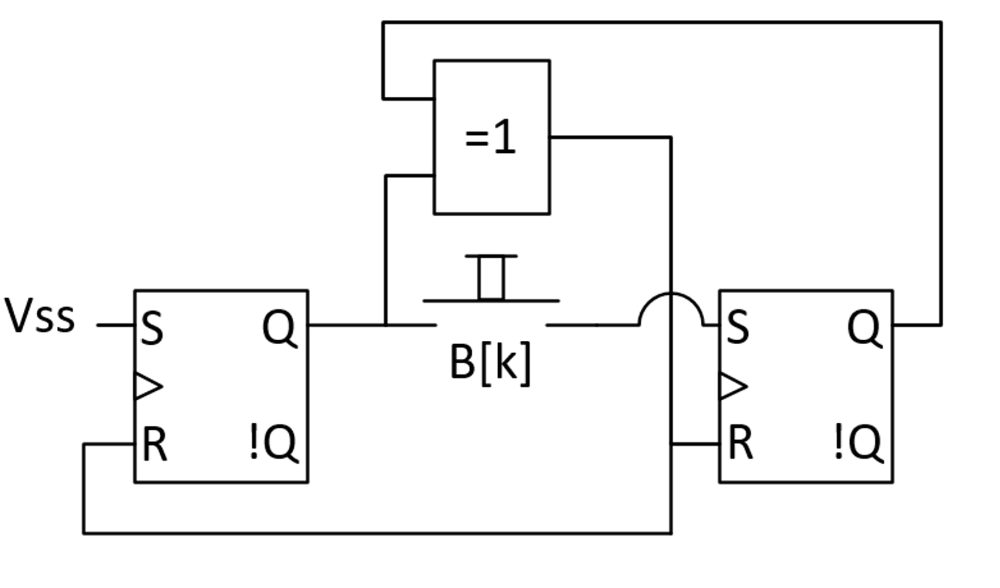
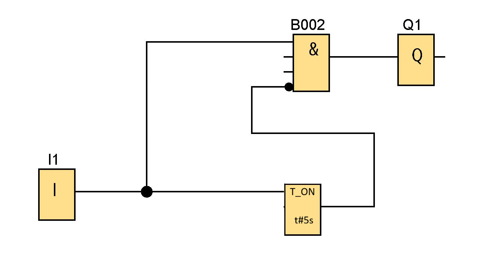
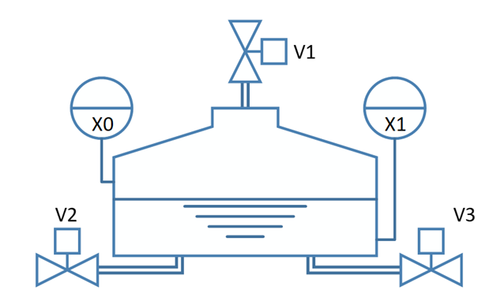

# Kolokvij 2 — Programirljivi logični krmilniki

---

## Naloga 1 — Analiza logičnega vezja (25 točk)

Za logično vezje na sliki zapišite:

1. Matematični opis (logični enačbi) *(5 točk)*

2. Pravilnostno tabelo *(10 točk)*

3. Diagram prehajanja stanj *(10 točk)*

---

## Naloga 2 — Analiza sekvenčnega vezja (25 točk)

Za logično vezje na sliki narišite diagram prehajanja stanj *(25 točk)*

---

## Naloga 3 — Realizacija krmilnega programa v FBD (20 točk)

Izhod **Q1** se aktivira ob aktivaciji vhoda **I1**. Izhod Q1 nato ostane aktiven **najmanj 5 sekund** in se po **3-kratni** aktivaciji vhoda **I2** deaktivira. Nato sistem preide v začetno stanje in ga lahko ponovno prožimo.

Zapišite krmilni program v jeziku **FBD** (Function Block Diagram).

---

## Naloga 4 — SFC za vodenje sistema vodoravnega rezervoarja (25 točk)

Narišite SFC za vodenje sistema, ki mora delovati na naslednji način:
Vodni rezervoar se polni preko ventila **V1**. Rezervoar polnimo do zgornjega nivoja, kjer se preklopi pontonski merilnik nivoja **X0**; nato zapremo ventil V1 in odpremo ventil **V2** ter praznimo rezervoar do spodnjega nivoja, dokler se ne preklopi pontonski merilnik nivoja **X1**. Nato zapremo ventil V2 in po **5 sekundah** pričnemo s ponovnim polnjenjem rezervoarja; ko je rezervoar poln (X0), ga izpraznimo preko ventila **V3**. Po dosegu spodnjega nivoja (X1) zapremo ventil V3 in po **5 sekundah** ponovimo cikel. Sistem se ponavlja v neskončni zanki in izmenično prazni rezervoar enkrat preko ventila V2, drugič preko ventila V3.

> Ventili V1, V2, V3 (0/1 … zaprt/odprt),  
> merilnika nivoja X0, X1 (0/1 … pod nivojem/nad nivojem)

