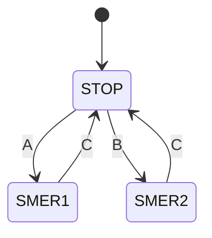

# Rešitev VP1: Krmiljenje DC motorja s tipkami A, B, C

## Opis naloge

Imamo DC motor in tri tipke:
- **A** – zažene motor v **smer 1**
- **B** – zažene motor v **smer 2**
- **C** – **ustavi** motor (velja za obe smeri)

Vezje mora biti samozadrževalno (motor ostane v delovanju po spustu tipke).

---

## Vhodi in izhodi

| Signal | Vrsta | Opis |
|--------|-------|------|
| A | Vhod | Tipka – zagon smer 1 (NO kontakt) |
| B | Vhod | Tipka – zagon smer 2 (NO kontakt) |
| C | Vhod | Tipka – stop (NO kontakt) |
| K1 | Izhod | Rele – krmili motor smer 1 |
| K2 | Izhod | Rele – krmili motor smer 2 |

### Stanja relejev → gibanje motorja

| K1 | K2 | Motor |
|:--:|:--:|-------|
| 0  | 0  | ustavljen |
| 1  | 0  | smer 1 |
| 0  | 1  | smer 2 |
| 1  | 1  | ⚠ prepovedano (medsebojna blokada) |

---

## Diagram stanj (State flow diagram)


---

## Resničnostna tabela (Truth table)

Tabela prikazuje naslednje stanje izhodov glede na vhode in trenutno stanje relejev.

| A | B | C | K1[k] | K2[k] | K1[k+1] | K2[k+1] |
|:-:|:-:|:-:|:-----:|:-----:|:-------:|:-------:|
| 0 | 0 | 0 |   0   |   0   |    0    |    0    |
| 0 | 0 | 1 |   0   |   0   |    0    |    0    |
| 0 | 1 | 0 |   0   |   0   |    0    |    1    |
| 0 | 1 | 1 |   0   |   0   |    0    |    0    |
| 1 | 0 | 0 |   0   |   0   |    1    |    0    |
| 1 | 0 | 1 |   0   |   0   |    0    |    0    |
| 1 | 1 | 0 |   0   |   0   |    ⚠    |    ⚠    |
| 1 | 1 | 1 |   0   |   0   |    0    |    0    |
| 0 | 0 | 0 |   1   |   0   |    1    |    0    |
| 0 | 0 | 1 |   1   |   0   |    0    |    0    |
| 0 | 1 | 0 |   1   |   0   |    1    |    0    |
| 0 | 1 | 1 |   1   |   0   |    0    |    0    |
| 1 | 0 | 0 |   1   |   0   |    1    |    0    |
| 1 | 0 | 1 |   1   |   0   |    0    |    0    |
| 1 | 1 | 0 |   1   |   0   |    1    |    0    |
| 1 | 1 | 1 |   1   |   0   |    0    |    0    |
| 0 | 0 | 0 |   0   |   1   |    0    |    1    |
| 0 | 0 | 1 |   0   |   1   |    0    |    0    |
| 0 | 1 | 0 |   0   |   1   |    0    |    1    |
| 0 | 1 | 1 |   0   |   1   |    0    |    0    |
| 1 | 0 | 0 |   0   |   1   |    0    |    1    |
| 1 | 0 | 1 |   0   |   1   |    0    |    0    |
| 1 | 1 | 0 |   0   |   1   |    0    |    1    |
| 1 | 1 | 1 |   0   |   1   |    0    |    0    |

> **Opomba:** Primer `A=1, B=1, C=0` pri `K1[k]=0, K2[k]=0` je nedefiniran — vezje mora to preprečiti (medsebojna blokada). Stanje `K1[k]=1, K2[k]=1` je prepovedano in se ne sme pojaviti.

---

## Veitch diagram — minimizacija

5 spremenljivk: **A, B, C, K1[k], K2[k]**

Enoten diagram 4×8 celice:
- **Vrstice** (2 spremenljivki, Gray koda): `K1[k] · B` → 00, 01, 11, 10
- **Stolpci** (3 spremenljivke, Gray koda): `K2[k] · C · A` → 000, 001, 011, 010, 110, 111, 101, 100

Razponi spremenljivk (kot oklepaji v diagramu):
- **K1[k]** = 1 : vrstici `11`, `10`
- **B** = 1 : vrstici `01`, `11`
- **K2[k]** = 1 : stolpci `110`, `111`, `101`, `100`
- **C** = 1 : stolpci `011`, `010`, `110`, `111`
- **A** = 1 : stolpci `001`, `011`, `111`, `101`

`d` = don't care

---

### K1[k+1]

| K1B \ K2CA | 000 | 001 | 011 | 010 | 110 | 111 | 101 | 100 |
|:----------:|:---:|:---:|:---:|:---:|:---:|:---:|:---:|:---:|
|     00     |  0  |  1  |  0  |  0  |  0  |  0  |  0  |  0  |
|     01     |  0  |  d  |  0  |  0  |  0  |  0  |  0  |  0  |
|     11     |  1  |  1  |  0  |  0  |  d  |  d  |  d  |  d  |
|     10     |  1  |  1  |  0  |  0  |  d  |  d  |  d  |  d  |

**Grupi:**
- 🔵 Vrstici `11`, `10` × stolpci `000`, `001`, `100`, `101` (razširimo z `d` na K2=1) → **K1=1, C=0** → **K1[k] · !C**
- 🟠 Vse vrstice × stolpec `001` (vrstica `01` je `d`) → **K2=0, C=0, A=1** → **A · !C · !K2[k]**

$$\boxed{K1[k{+}1] = \overline{C} \cdot \bigl(K1[k] + A \cdot \overline{K2[k]}\bigr)}$$

---

### K2[k+1]

| K1B \ K2CA | 000 | 001 | 011 | 010 | 110 | 111 | 101 | 100 |
|:----------:|:---:|:---:|:---:|:---:|:---:|:---:|:---:|:---:|
|     00     |  0  |  0  |  0  |  0  |  0  |  0  |  1  |  1  |
|     01     |  1  |  d  |  0  |  0  |  0  |  0  |  1  |  1  |
|     11     |  0  |  0  |  0  |  0  |  d  |  d  |  d  |  d  |
|     10     |  0  |  0  |  0  |  0  |  d  |  d  |  d  |  d  |

**Grupi:**
- 🔵 Vse vrstice × stolpci `101`, `100` (razširimo z `d` na K1=1) → **K2=1, C=0** → **K2[k] · !C**
- 🟠 Vrstica `01` × stolpci `000`, `001`(d), `100`, `101` → **K1=0, B=1, C=0** → **B · !C · !K1[k]**

$$\boxed{K2[k{+}1] = \overline{C} \cdot \bigl(K2[k] + B \cdot \overline{K1[k]}\bigr)}$$

---

### Povzetek minimiziranih enačb

$$K1[k{+}1] = \overline{C} \cdot \bigl(K1[k] + A \cdot \overline{K2[k]}\bigr)$$

$$K2[k{+}1] = \overline{C} \cdot \bigl(K2[k] + B \cdot \overline{K1[k]}\bigr)$$

> Obe enačbi vsebujeta **samozadrževanje** (K·!C) in **medsebojno blokado** (!K2 oz. !K1).

---

## Kontaktna shema (Ladder diagram)

```
TODO
```

---

## Opombe

- Tipka C mora prekiniti oba tokokroga.
- Medsebojna blokada prepreči hkratni sočasni vklop obeh smeri (kratki stik motorja).
- NC kontakt tipke C je vezan zaporedno v oba tokokroga.
